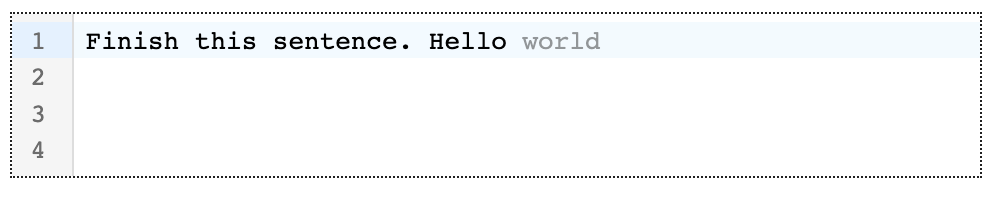

# codemirror-extension-inline-suggestion

This package implements inline suggestions for the CodeMirror code editor.



## Install

```bash
npm install codemirror-extension-inline-suggestion --save
```

## Usage

[](https://codesandbox.io/s/codemirror-extension-inline-suggestion-m5o8lf?fontsize=10&hidenavigation=1&theme=dark)

```tsx
import CodeMirror from '@uiw/react-codemirror';
import { inlineSuggestion } from 'codemirror-extension-inline-suggestion';

const fetchSuggestion = async (state) => {
  // or make an async API call here based on editor state
  return 'hello';
};

function App() {
  return (
    <CodeMirror
      value=""
      height="200px"
      extensions={[
        fetchSuggestion({
          fetchFn: inlineSuggestion,
          delay: 1000,
        }),
      ]}
    />
  );
}

export default App;
```

## License

MIT
